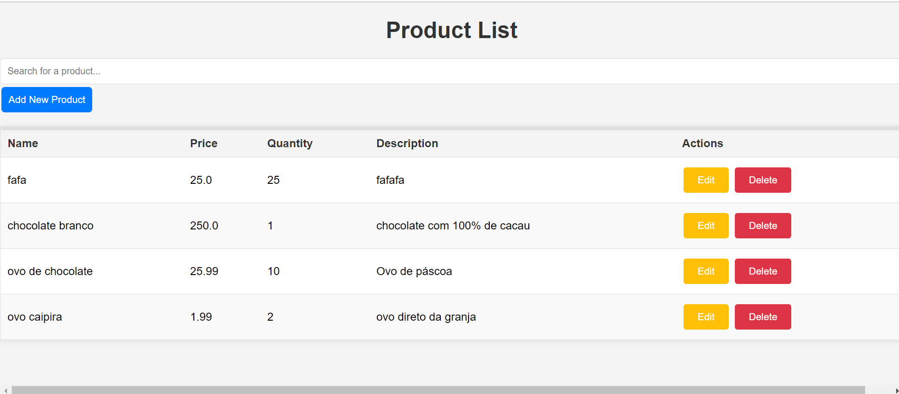
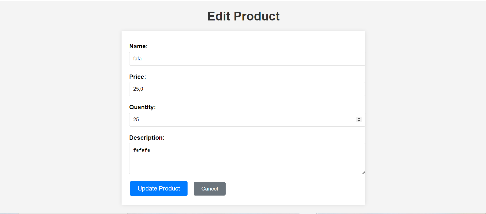

# Controle de Estoque
[](https://github.com/pedromarzig/estoqueMarquinhos/blob/main/LICENSE)

# Sobre o projeto

O Estoque Marquinhos é um sistema de gerenciamento de estoque desenvolvido em Java, utilizando o framework Spring MVC. O objetivo do projeto é simplificar o controle de produtos em pequenas e médias empresas, oferecendo funcionalidades como gerenciamento de produtos, busca dinâmica, e relatórios de estoque. A interface do usuário é construída com Thymeleaf e HTML/CSS, enquanto o MongoDB é utilizado como banco de dados. O sistema também inclui JavaScript para aprimorar a interatividade da interface.


# Tecnologias utilizadas
## Back end
- Java
- Spring Boot
- Spring Data Mongodb
- Maven

## Implantação em produção
- Back end: Aplicação Java com Spring Boot
- Banco de dados: Mongodb

# Como executar o projeto

## Back end
Pré-requisitos: Java 11

```bash
# clonar repositório
git clone https://github.com/pedromarzig/estoqueMarquinhos.git

# executar o projeto
./mvnw spring-boot:run
```

## Imagens
### Home


### Edição


### Adicionar


# Autor

Pedro Marzig Castelani

https://www.linkedin.com/in/pedro-marzig-205a35212/

Este projeto foi desenvolvido como parte de um processo de aprendizado, com a ajuda de estudos e sugestões de ferramentas como o ChatGPT.
